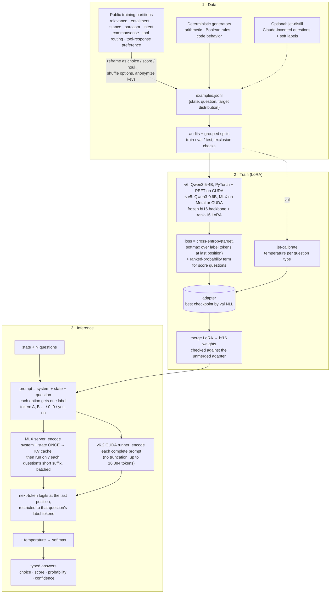

# Jet

Jet is a typed decision model built on **Qwen3.5-4B** (v6.2). Give it a state and named,
typed questions; it returns choices, scores, and probabilities without generating
free-form text. Answers always follow the requested type, but decisions can still
be wrong.

[Model weights](https://huggingface.co/michaljach/jet) ·
[Hugging Face demo](https://huggingface.co/spaces/michaljach/jet) ·
[Training history](TRAINING_HISTORY.md) ·
[Training run records](experiments/jet-focused-20260925/README.md)

| Type | Criteria | Answer |
|---|---|---|
| `choice` | 2–255 named options | Selected key, probability per key, confidence |
| `score` | 2–10 ordered levels | Fractional score, selected level, probabilities |
| `noul` | None | Probability that the answer is yes |

## Run locally

**Jet v6.2 (Linux + NVIDIA CUDA).** The Hugging Face release is self-contained: it
ships the merged bf16 weights with the runtime from [`releases/jet-v6.2/`](releases/jet-v6.2/) and
`src/format.py` / `src/inference.py`.

```sh
hf download michaljach/jet --revision v6.2.0 --local-dir jet
cd jet
python -m pip install -r requirements.txt
echo '{"state":"I was charged twice this month.","questions":{"billing":{"type":"noul","instructions":"Is this a billing issue?"}}}' | python jet.py
```

**MLX server (Apple Silicon, or Linux via MLX CUDA).** The HTTP server and the
training pipeline in this repository run the earlier Qwen3-0.6B releases. The last
one is kept in the model repository's history at revision `25ccbd9e`:

```sh
git clone https://github.com/quaedra/jet
cd jet
uv sync                  # Apple Silicon / Metal
# Linux with NVIDIA: uv sync --extra cuda
hf download michaljach/jet --revision 25ccbd9e09c75643b3c2214e2b2522bec39171a7 --local-dir models/jet-0.6b
JET_API_KEY=secret uv run jet-serve --base-model models/jet-0.6b
```

```sh
curl http://localhost:8000/v1/decide \
  -H 'Authorization: Bearer secret' \
  -H 'Content-Type: application/json' \
  -d '{"state":"I was charged twice this month.","questions":{"topic":{"type":"choice","instructions":"What is the primary issue?","criteria":{"billing":"billing or payment problem","bug":"the product is broken"}},"escalate":{"type":"noul","instructions":"Does this require human support?"}}}'
```

The model requires Jet's prompt format and label-token readout. It is not a chat
model. The MLX server shares the state prefix across questions, applies the saved
calibration temperatures, and returns typed answers. Serving truncates long states
in the middle; the Decision Index adapter instead requires complete inputs.

## How it works



Each answer option maps to a single token. Jet reads the next-token logits only
for those labels and applies softmax with a temperature fitted on held-out data.
Standard serving uses one forward pass per question, without sampling.
The fused bf16 weights include the trained LoRA updates.

The benchmark package also provides `decision_index_ensemble:TwoOrderJetEngine`.
It averages original and reversed option-order probabilities using exact option
keys. This approximately doubles forward-pass work and is separate from the
standard serving API.

## Training and evaluation

Jet v6.2.0 is the full merged step-250 continuation of released Jet v6.1.
Two 1,000-update rank-16 LoRA trials used 4,000 examples, split evenly between
banking/entity sentiment/sarcasm and broad retention. Validation selected the
3e-6 trial at step 250; the higher-rate trial failed its regression guards.

The standalone merged model was evaluated on the same frozen 914-case holdout:

| Local holdout | Jet v6.1 | Jet v6.2 merged |
|---|---:|---:|
| Banking accuracy | 74.68 | 74.68 |
| Entity sentiment macro-F1 | 71.16 | 71.21 |
| Sarcasm F1 | 46.81 | 50.00 |
| Retention accuracy | 93.40 | 93.40 |

These are local holdout results, not Decision Index scores. Focus cases were
screened against previous local inputs; retention cases were reused. Financial
sentiment uses SEntFiN, not the FinEntity benchmark. The small changes do not
establish statistical significance. BF16 merging reduced the adapter's finance
F1 from 71.72 to 71.21, so only the merged scores above describe the release.

Merge checks preserved selected answers on all 157 fixed cases; maximum
probability difference was 4.76 percentage points. Calibration temperatures are
inherited, not refitted for this continuation. The complete 11,495-token API-Bank
prompt passed the new 16,384-token runtime limit without truncation; its full
benchmark score remains unmeasured.

The earlier 25-benchmark comparison measures the **v6.1 step-2,000 adapter before
its BF16 merge**, not v6.2. It includes 23 full available reconstructions and two
retrieval samples against archived Decision Index 0.1 reference scores. Matching
metrics and counts do not establish identical cases.

**Decision Index 0.3 (official, 2026-10-07):** Jet v6.2 scores **40.01**, rank 52 of
113, run by the index maintainers on the full 110,201-request suite (public 42.17,
same skills 40.93, new domains 34.46). Details in [docs/decision-index.md](docs/decision-index.md).

[Historical v6.1 benchmark report](experiments/jet-kev-comparison-20260925/results.md) ·
[Current full-model results](releases/jet-v6.2/evaluation.json) ·
[Model card and merge verification](releases/jet-v6.2/README.md) ·
[Training protocol and records](experiments/jet-focused-20260925/README.md) ·
[Training history](TRAINING_HISTORY.md)

Release scripts and gates are recorded under
[`experiments/jet-release-20260926/`](experiments/jet-release-20260926/).
The older MLX training scripts reproduce Qwen3-0.6B generations; v6 onward uses
PyTorch/PEFT, with `src/qwen35_training.py` providing the common backend.

## Deployment

The Hugging Face model repository holds v6.2: merged bf16 weights (nine shards,
8.4 GB), tokenizer, calibration, the CUDA runtime, and provenance and validation
records. Everything except the weights and tokenizer is kept in
[`releases/jet-v6.2/`](releases/jet-v6.2/); `scripts/publish_release.py` uploads it.
The Space code serves the last Qwen3-0.6B release (V5, revision `25ccbd9e`) and exposes
`/decide`; its availability depends on Hugging Face's free hosting quota. See
[deployment instructions](deploy/huggingface/README.md).

To cut a new release from a Qwen3.5-4B adapter (Linux + CUDA), merge it into the
release folder, check it against the adapter's saved logits, then publish:

```sh
uv run python scripts/merge_release.py --adapter adapters/<run>/best --step <step>
uv run python scripts/validate_release.py --case <rows.jsonl> <adapter-logits.json>
uv run python scripts/publish_release.py --version v6.x.y --dry-run   # then without --dry-run
```

The ONNX/browser build exists for the Qwen3-0.6B releases only (revision `25ccbd9e`
contains the V5 `onnx/model_q8.onnx`). It supports CPU and browser runtimes through ONNX Runtime.
`jet-golden` generates reference cases, and `export_web.sh` exports and checks
the browser model. Export validation is recorded with the model package;
quantization can change probabilities.

## Project layout

- `src/format.py`, `src/inference.py`: prompts and typed answers
- `src/model.py`, `src/torch_model.py`, `src/onnx_model.py`: inference backends
- `src/train.py`, `src/evaluate.py`, `src/fuse.py`: training, calibration, evaluation and fusion
- `src/data/`, `scripts/`: data builders and reproducible experiments
- `src/decision_index_engine.py`, `src/decision_index_ensemble.py`: benchmark adapters
- `releases/jet-v6.2/`: v6.2 model card, CUDA runtime and release records published with the Hugging Face weights
- `deploy/huggingface/`: hosted demo and API deployment
